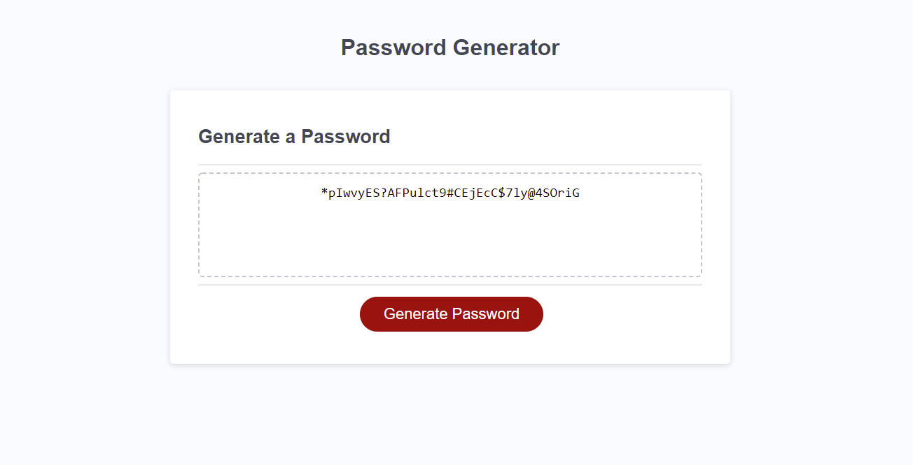

# Password Generator Using Alerts

## Description
Passwords are hard to come up with and even harder to keep secure. By building a password generator that takes in the users input for how many characters they want, if they want special characters, numeric characters, and lower and uppercase letters in their passwords, users are able to get a more secure passwords. 

By using Javascript, arrays can be generated and randomly selected from to fit the criterium that has been selected by the user. In this particular build, using alerts and a prompt, it interfaces directly with the user without relying on full DOM manipulation of the HTML. 

## Links

Github link : https://github.com/MAMcC0/password-generator-via-alerts
Live Link: https://mamcc0.github.io/password-generator-via-alerts/

## Technologies Used:
HTML, CSS, and JavaScript

## Image of Working Site

